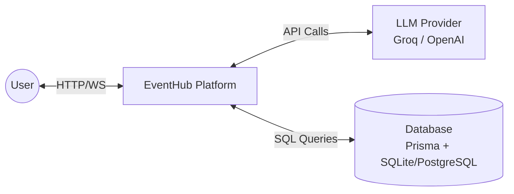
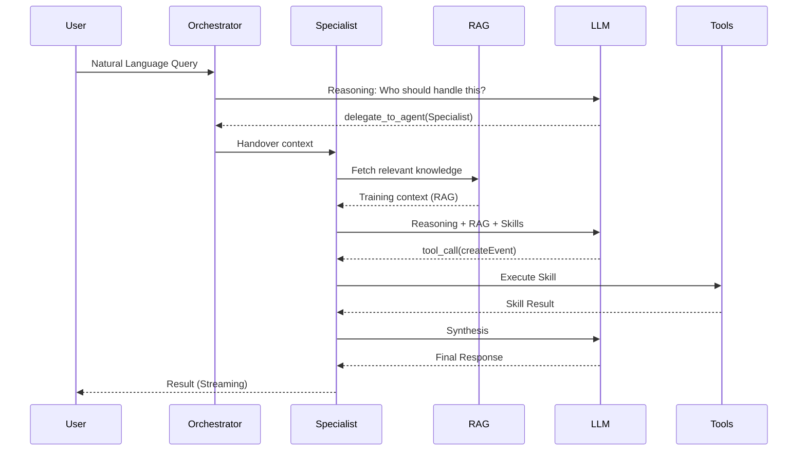

# C4 Architecture Model — AI Agent Swarm & MLOps

This document provides a detailed view of the **AI Agentic System** within the EventHub platform, following the C4 model.

## Level 1: System Context



**Description**: The User interacts with the Agentic system via the Frontend SPA. The Platform acts as a broker, managing the session context, database interaction (RAG), and orchestrating calls to external LLM providers.

## Level 2: Container Diagram

```mermaid
graph TD
    User((User))
    
    subgraph Frontend SPA
        AgentUI[Agents UI / Builder]
        AssistantUI[Assistant Chat]
    end

    subgraph Backend API (NestJS)
        Orchestrator[Master Orchestrator]
        Specialists[Specialized Agents]
        Registry[Skill Registry]
        RAG[Knowledge Base / RAG]
    end

    DB[(Database)]
    LLM[LLM Provider]

    User <--> AgentUI
    User <--> AssistantUI
    
    AgentUI <-->|REST| Registry
    AssistantUI <-->|WebSocket| Orchestrator
    
    Orchestrator <-->|Handover| Specialists
    Specialists <-->|Query| RAG
    Specialists <-->|Tool Call| Registry
    RAG <--> DB
    Registry <--> DB
    
    Specialists <-->|Completion| LLM
    Orchestrator <-->|Reasoning| LLM
```

## Level 3: Component Diagram (AI Module)

### The MLOps Workflow (Builder)
1. **Skill Registry**: Manages `Skill` entities. Skills define a `name`, `description`, and `parameters` (JSON Schema).
2. **Agent Assembly**: Manages `Agent` entities. Agents are linked to multiple `Skills`.
3. **Knowledge Base (RAG)**: Manages `Knowledge` entries. Each entry is a text snippet associated with an agent.

### The Swarm Execution Cycle


## Level 4: Code & Data Models

### Data Models (Prisma)
- **Agent**: Core identity and system instructions.
- **Skill**: Tool definitions for function calling.
- **Knowledge**: Persistent memory for RAG.

### MLOps Best Practices Implemented:
1. **Decoupled Identity**: Agents are separated from their skills, allowing for modular assembly.
2. **Dynamic Tools**: Skills are not hardcoded; they are fetched from the database at runtime.
3. **RAG vs. Fine-tuning**: Domain expertise is injected via RAG, reducing cost and latency compared to model training.
4. **Hierarchical Swarm**: A Master Orchestrator ensures complex queries are routed to the most capable specialist.
